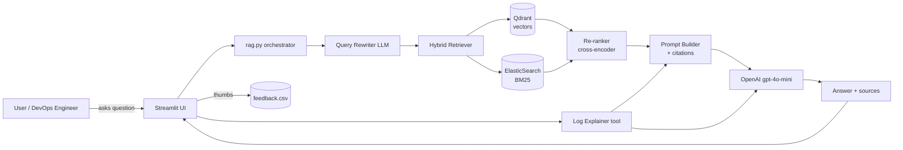
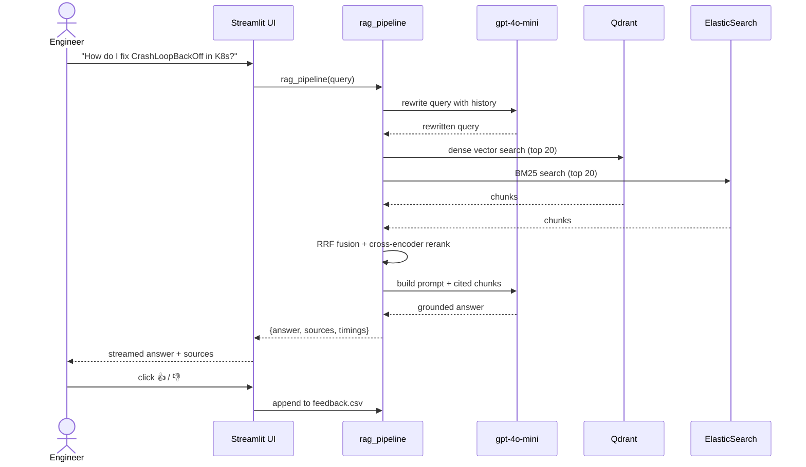
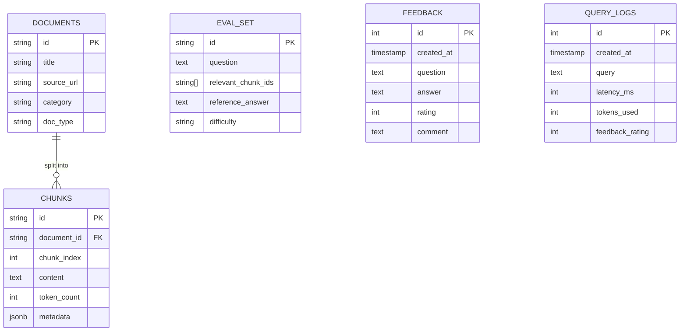

## Plan: OpsAssist AI — MVP + Future Roadmap

**TL;DR** Ship a Streamlit chat app that ingests curated DevOps/Platform Engineering documentation (K8s, Docker, Terraform, AWS, Linux, CI/CD), supports log/Q&A retrieval, includes a "log explainer" tool, and runs end-to-end on docker-compose within ~2 weeks. Then layer agent capabilities, API integrations, and cloud deployment in later versions.

**Architecture diagram (MVP)**



**MVP data flow**



**MVP data model (simplified)**



---

### Phase 0 — Idea Lock-In (Day 1)
1. **Define MVP problem statement:**
   *"OpsAssist AI helps DevOps/Platform engineers quickly diagnose infrastructure problems by retrieving answers from official documentation (Kubernetes, Docker, Terraform, AWS, Linux, CI/CD) and explaining error logs in plain English."*
2. Lock the MVP scope — do **not** add live cloud agents in v0.1.
3. Sketch 10 sample user questions (5 docs lookup, 5 log/error explanation).

---

### Phase 1 — Repository & Stack (Day 1–2)
4. Create repo `opsassist-ai`. Add `.gitignore`, `LICENSE`, `README.md`, `.env.example`, `requirements.txt` (pinned versions).
5. **Final stack:**

   | Layer | MVP choice |
   |---|---|
   | LLM | OpenAI `gpt-4o-mini` |
   | Embeddings | `text-embedding-3-small` |
   | Vector DB | **Qdrant** (in docker-compose) |
   | Keyword DB | **ElasticSearch** (for BM25) |
   | Hybrid fusion | **RRF** |
   | Re-ranking | `cross-encoder/ms-marco-MiniLM-L-6-v2` |
   | UI | **Streamlit** |
   | Container | docker-compose (app + qdrant + elastic + postgres) |

6. Folder structure:

   ```
   opsassist-ai/
   ├── README.md
   ├── setup.md
   ├── docker-compose.yml
   ├── Dockerfile
   ├── requirements.txt
   ├── .env.example
   ├── data/
   │   ├── raw/                # downloaded docs
   │   ├── chunks/             # processed chunks.jsonl
   │   ├── eval/               # eval Q&A
   │   └── feedback/           # feedback.csv
   ├── notebooks/
   │   ├── 01_data_prep.ipynb
   │   ├── 02_retrieval_eval.ipynb
   │   └── 03_llm_eval.ipynb
   ├── src/
   │   ├── ingest.py
   │   ├── index.py
   │   ├── retriever.py
   │   ├── reranker.py
   │   ├── query_rewriter.py
   │   ├── rag.py
   │   ├── tools/
   │   │   └── log_explainer.py
   │   ├── evaluate.py
   │   ├── monitoring.py
   │   └── app.py
   └── images/
   ```

---

### Phase 2 — Data Acquisition (Day 3)
7. Curate **5–7 official doc sources** (all publicly scrapeable; respect each site's `robots.txt`):
   - Kubernetes official docs (`kubernetes.io/docs`).
   - Docker docs (`docs.docker.com`).
   - Terraform docs (`developer.hashicorp.com/terraform`).
   - AWS Well-Architected + common service FAQs.
   - Linux man pages / `explainshell.com` snapshots.
   - GitHub Actions docs.
   - Prometheus / Grafana docs.
8. Save raw pages/HTML to `data/raw/<source>/`, log each URL in `data_sources.md`.

---

### Phase 3 — Ingestion Pipeline (Day 4–5)
9. **`src/ingest.py`** — single idempotent script:
   - `download_data()` (skips if already present).
   - `clean_and_chunk()` → 500-token chunks, 100-token overlap, keep `source`, `category`, `title`, `section`, `url`.
   - `embed_and_upsert()` → Qdrant collection `opsassist_docs`.
   - `index_bm25()` → ElasticSearch index `opsassist_chunks`.
10. Embed only **once**; persist collection snapshots if feasible to avoid re-embedding on every run.

---

### Phase 4 — RAG Pipeline (Day 6–8)
11. **`src/rag.py`** with the four functions: `retrieve`, `build_prompt`, `llm_answer`, `rag_pipeline`.
12. **Hybrid retrieval:** dense from Qdrant + BM25 from ElasticSearch → fuse via RRF.
13. **Re-ranking:** retrieve top 20 → cross-encoder rerank → keep top 5.
14. **Query rewriting:** small LLM call to rewrite ambiguous questions using chat history.

---

### Phase 5 — MVP Tools (Day 9)
15. **`src/tools/log_explainer.py`** — first MVP tool:
   - User pastes a log block (k8s `kubectl logs`, systemd journal, nginx error, docker output).
   - Assistant returns: *probable cause*, *why*, *recommended fix*, *doc citation*.
   - Reuses `build_prompt` from `rag.py` with explicit "log explainer" system prompt.
16. (Stretch, optional in MVP) **`src/tools/config_reviewer.py`** — paste a YAML/Dockerfile/Terraform HCL snippet → assistant highlights anti-patterns and suggests fixes.

---

### Phase 6 — Evaluation (Day 10–11) ⭐ highest impact
17. Write **30+ manual eval Q&A** spanning the 5 doc categories and log scenarios — save to `data/eval/eval.jsonl`.
18. **`src/evaluate.py`** computes Hit Rate@k, MRR, NDCG@10.
19. `notebooks/02_retrieval_eval.ipynb` benchmarks:
    - vector-only (k=5),
    - vector-only (k=20) + rerank,
    - hybrid (k=20) + rerank,
    - hybrid + rerank + query rewriting.
    Pick the winner, document the comparison table + bar chart.
20. `notebooks/03_llm_eval.ipynb` benchmarks **3+ prompt styles** (concise, with-citations, CoT, log-expert). LLM-as-judge on 1–5 scales for relevance / faithfulness / completeness.

---

### Phase 7 — Streamlit UI (Day 12–13)
21. **`src/app.py`** requirements:
    - Chat input + streaming answer.
    - **Mode toggle:** "Docs Q&A" vs "Explain Log".
    - Collapsible source list with similarity scores and click-through to raw doc URL.
    - 👍 / 👎 feedback buttons → `data/feedback/feedback.csv`.
    - Sidebar: recent queries, example questions.
22. Take screenshots → `images/`.

---

### Phase 8 — Monitoring (Day 14)
23. Feedback collection (already done above).
24. **Monitoring dashboard** with **≥5 charts:**
    1. Ratings pie
    2. Questions per day
    3. Avg latency per day
    4. Top 10 queries (bar)
    5. Tool usage split: docs vs log-explainer
    6. (bonus) Token usage per day

---

### Phase 9 — Containerization (Day 15)
25. `Dockerfile` for Streamlit app.
26. `docker-compose.yml` with `app + qdrant + elasticsearch + postgres`.
27. Verify clean clone → `docker-compose up` → app reachable on `localhost:8501`.

---

### Phase 10 — Documentation & Submission (Day 16)
28. `README.md` sections: problem • dataset • architecture diagram (Mermaid) • stack • run instructions • evaluation results • screenshots • monitoring • limitations.
29. `setup.md` — exact prerequisites + copy-paste commands.
30. Optional 30-second demo video (Loom / Streamlit recorder).
31. Submit GitHub URL + commit hash.

---

## Beyond MVP — Future Versions

### v1.1 — Quality & Coverage (next 2–4 weeks)
- **Larger knowledge base:** add Helm, ArgoCD, Datadog, GCP, Azure docs.
- **Auto-refresh pipeline** on schedule (cron + Mage) to detect doc updates.
- **Citation precision:** enforce URL + section anchor in every claim; add a "verification" agent that double-checks cited chunks.
- **Multi-language logs:** support log/error explanation in English + Hindi/Spanish.
- **Prompt library UI:** let users pick prompt style (concise / verbose / runbook-style).
- **Test suite:** pytest for `retriever`, `reranker`, `rag_pipeline`.

### v2.0 — AI Agents + Live Integrations
- **Diagnostic Agent** — multi-step planner that:
  1. Asks clarifying questions,
  2. Retrieves relevant docs,
  3. Calls tools (`log_explainer`, `config_reviewer`, `runbook_lookup`),
  4. Synthesizes a runbook.
- **Read-only cloud tools** (with explicit user permission):
  - `kubectl_get_events` — fetch & explain current cluster events.
  - `aws_describe` — read-only AWS resource inspection.
  - `terraform_plan_explainer` — paste/upload `tf plan` JSON → explain risk.
- **Runbook generator** from past incident chats.
- **Slack/Teams bot** interface alongside Streamlit.
- **Authentication:** simple OAuth + per-user chat history.
- **Per-tenant knowledge bases** (isolate engineer team data).

### v3.0 — Platform / Production
- **Cloud deployment** (Fly.io / Railway / AWS App Runner) — bonus points.
- **Observability stack:** OpenTelemetry traces, Grafana dashboards, PagerDuty alerts on eval-regression.
- **Continuous eval:** nightly run of `evaluate.py` against golden set, regression alerts.
- **Feedback loop:** 👍/👎 signals flow back into retrieval eval to identify weak queries.
- **Domain-specific fine-tunes** or adapter LoRAs for log/error patterns.
- **Multi-modal input:** paste diagrams / architecture screenshots, OCR → explain.
- **Enterprise features:** RBAC, audit log, SOC2-ready logging, on-prem deploy.
- **Mobile-friendly PWA** UI.

---

### Relevant files
- `f:\Project\LLM_ZOOMCAMP\Project_1\OPSASSIST_AI_ROADMAP.md` — milestone tracker to live alongside `PROJECT_PLAN.md`.
- `data_sources.md` — URLs of curated official docs (created in Phase 2).
- `src/rag.py` — core RAG orchestrator (Phase 4).
- `src/tools/log_explainer.py` — first domain tool (Phase 5).
- `docker-compose.yml` — single-command reproducibility (Phase 9).

---

### Verification
1. `docker-compose up` from a clean clone → app on `:8501`, Qdrant on `:6333`, ElasticSearch on `:9200`.
2. `python src/evaluate.py` → produces `eval_report.json` with metrics for the chosen retrieval approach.
3. Five dashboard charts render against `data/feedback/feedback.csv` after ≥10 test interactions.
4. README's "How to run" + "Evaluation results" sections match observed outputs.
